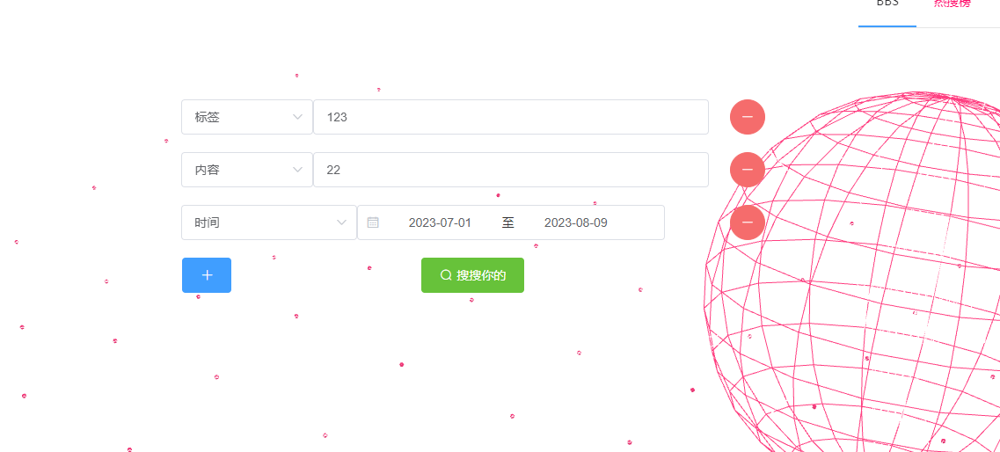

# SUSTECH CS307Project2
主要任务是实现一个论坛
## 使用方法
使用springboot和vue
首先mvn install来安装springboot相关依赖
然后再Vue文件夹内npm install来安装vue相关依赖
## 具体实现
### 架构
主要是用vue在前端绘制页面，把restful请求发送给后端springboot
springboot通过mybatis plus对数据库进行处理
在springboot的**Controller**层接受请求，**Service**层处理请求，在**Mapper**处进行数据持久化
### 效果展示
#### 登录页面

#### 帖子列表

#### 帖子内容
支持插入图片和视频

#### 多参数搜索
参数之间与关系，支持添加多种参数

